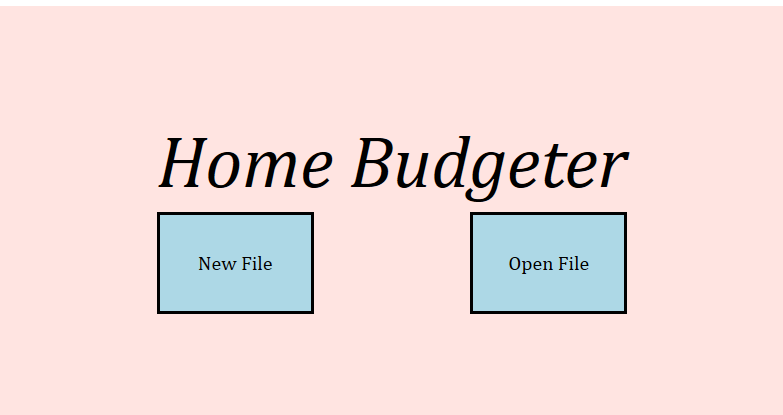
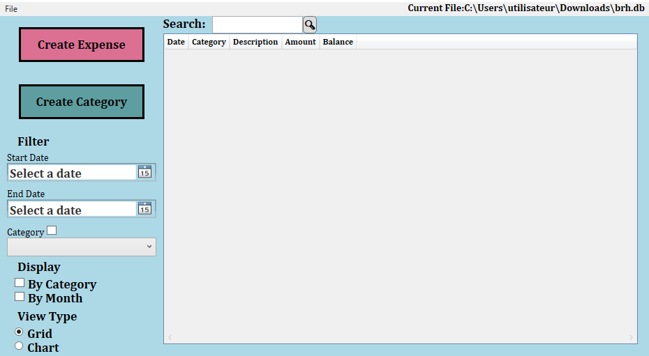
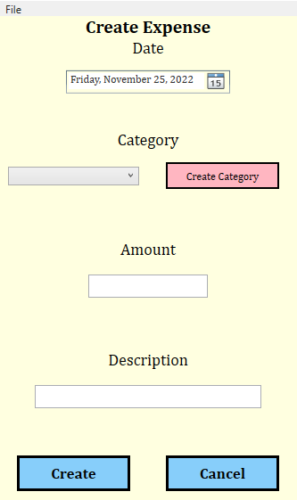
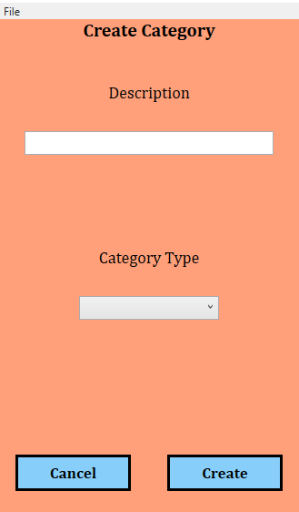

# BudgetingApp

Made in collaboration with Joseph Ambayec and Nathan Batten

## Main Concept 
This WPF application was made for a semester long series of milestones/assignmnents with the goal to learn Scrum project management.
The application is a simple home budget application that is easy to use.

When starting the app, the user can choose to either choose an existing .db file or create a new one. 
The .db file contains all expenses and expense cateories that the user creates.

The main window of the app consists of a list of expenses that can be sorted and filtered depending of the user's need.

Expenses and expense categories can be added in a few clicks.

